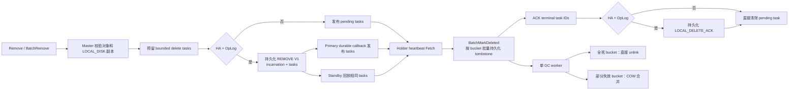
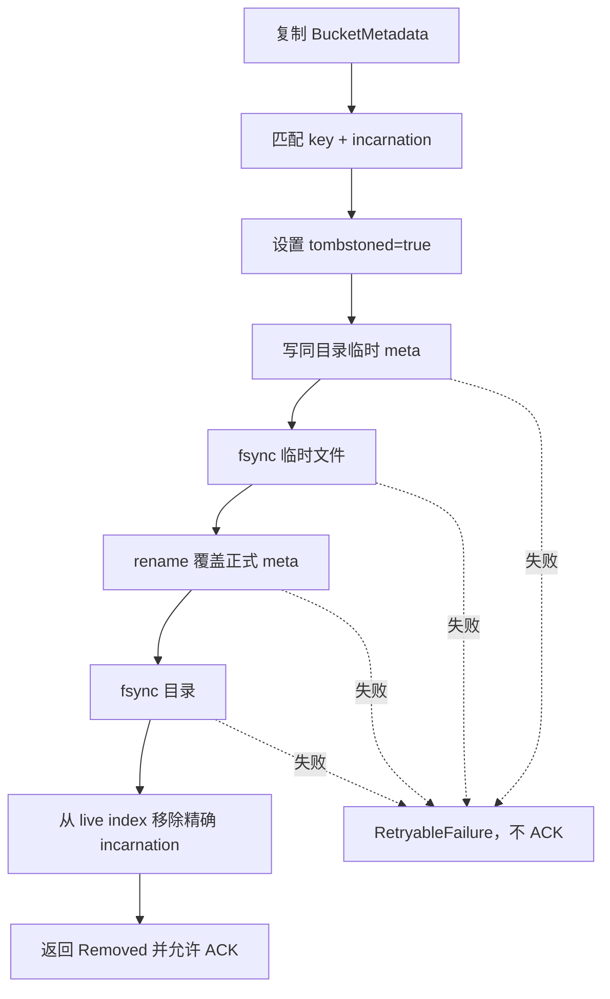
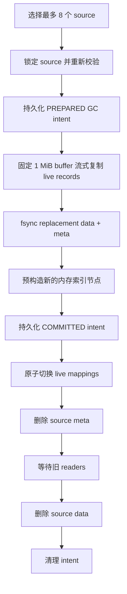
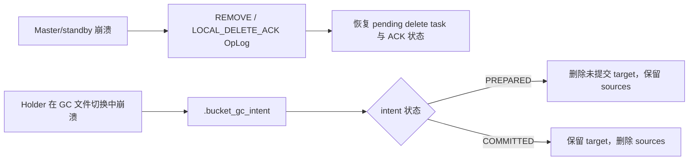

# `ssd_delete_new` 实现总结

## 1. 实现范围

本分支只处理 `Remove` 和 `BatchRemove` 产生的 `LOCAL_DISK` 对象删除，并完成
对应 SSD 空间回收：

- Master 为已完成、支持对象墓碑的 `LOCAL_DISK` 副本生成删除任务；
- HA 模式用 OpLog 持久化 `REMOVE` 删除意图和 `LOCAL_DELETE_ACK`；
- holder 按对象 incarnation 校验后持久化 tombstone；
- tombstone 对象立即不可读，重启扫描时也不会重新注册；
- 每个 bucket backend 只有一个 GC worker；
- 全死 bucket 直接删除；
- 部分失效 bucket 可一次合并最多 8 个；
- 普通情况按删除比例回收，超过 SSD 高水位时忽略比例门槛并向低水位回收；
- GC 用本地两阶段 intent 恢复 holder 文件系统上的中断操作。

不包含 `RemoveAll`、`RemoveByRegex`、其他存储后端、通用任务调度器、多 worker
GC、任意数量 bucket 的全局 bin-packing。

## 2. 端到端流程

这个链路是 at-least-once：Fetch 不删除任务，只有 ACK 最终清除任务。任务可能
重复下发，但持久 tombstone 和 incarnation 校验使重复执行安全。

## 3. 防止对象“复活”和误删

每个逻辑对象有一个 128 位 `ObjectIncarnation`。它从 Master 一直传播到：

- Master/standby 对象元数据和 snapshot；
- offload task；
- `LOCAL_DISK` replica descriptor；
- bucket 对象元数据；
- delete task。

holder 只有在 key 和 incarnation 同时匹配时才写 tombstone。删除旧版本 N 后，
即使同名 key 已创建为 N+1，延迟到达的 N 删除任务也只返回 `StaleVersion`，
不会修改新对象。

bucket 存储目录还持久化 `.mooncake_local_disk_segment_id`，并使用 mount epoch
和本地 advisory lock 防止旧进程或同盘双挂载错误地 Fetch/ACK 任务。

## 4. Tombstone

同一批任务先按 bucket 分组，每个受影响 bucket 最多做一次元数据重写：

处理结果：

| 结果 | 语义 | ACK |
| --- | --- | --- |
| `Removed` | 本次成功持久化 tombstone | 是 |
| `AlreadyRemoved` | 相同 incarnation 已经持久化删除 | 是 |
| `StaleVersion` | 旧 incarnation 已不存在 | 是 |
| `RetryableFailure` | 文件或内部操作失败 | 否 |

墓碑落盘后，对象从 `IsExist`、`BatchLoad`、`ScanMeta`、`BucketScan` 和 holder
live index 中消失。此时只完成逻辑删除，物理 bucket 文件仍存在，等待 GC。

## 5. GC、水位与多个 bucket 合并

### 5.1 调度

每个 `BucketStorageBackend` 只有一个后台 worker，使用三个新增参数：

| 环境变量 | 默认值 | 作用 |
| --- | ---: | --- |
| `MOONCAKE_OFFLOAD_BUCKET_GC_ENABLE` | `true` | 是否启用 GC |
| `MOONCAKE_OFFLOAD_BUCKET_GC_INTERVAL_SECONDS` | `10` | 普通扫描周期 |
| `MOONCAKE_OFFLOAD_BUCKET_GC_DELETED_RATIO` | `0.25` | 普通删除比例门槛 |

新 tombstone 会唤醒一次 worker；没有新任务时按周期扫描。水位路径只在实际达到
高水位后额外唤醒，避免每次 heartbeat 都扫描所有 bucket。

候选优先级为：

1. 全死 bucket；
2. 删除比例更高；
3. 可回收字节更多；
4. bucket ID 更小。

### 5.2 高低水位

GC 复用现有 FileStorage 高低水位。超过高水位时，任何包含 dead bytes 的
bucket 都可以被回收，不受普通删除比例限制；worker 持续执行，直到：

- 物理计账回落到低水位；
- 没有更多可回收 candidate；
- 本轮出现错误或收到停止信号。

如果 GC 被关闭或不存在可回收字节，系统回退到原有 live bucket eviction，不会
因为 tombstone 永久阻塞磁盘保护。

### 5.3 多 bucket 合并

部分失效 bucket 采用 copy-on-write：

约束：

- 单次最多 8 个 source；
- replacement 的 live key 数不超过现有 `bucket_keys_limit`；
- replacement 的 live 字节不超过现有 `bucket_size_limit`；
- 只保留一个 worker，不并行压缩；
- value 使用固定 1 MiB 缓冲流式复制，不按 bucket 大小分配内存；
- 全死 bucket 不创建空 replacement，直接删除。

物理 `total_size_` 在 replacement 创建后临时同时计入 source 和 target，只有
source 文件确认删除后才减少，避免把未 unlink 的空间提前报告为已回收。

## 6. 两类崩溃恢复

Master 与 holder 的持久化职责不同，不能只靠一种日志：

- OpLog 解决“这个对象版本必须删除、任务是否已 ACK”的集群状态；
- `.bucket_gc_intent` 解决“holder 本地 source/target 文件谁是权威”的文件系统
  状态；
- tombstone 自身位于同步后的 `.meta` 中，holder 在 ACK 前崩溃会安全重投。

因此，OpLog 是集群删除意图的保证，但不能替代 holder 本地 GC intent。

## 7. 性能边界

这一版没有把 GC 放在 `Remove`、`BatchRemove` RPC 或 holder heartbeat 的同步
路径中。同步删除只重写受影响 bucket 的小型 metadata；数据拷贝由后台线程
执行。

主要性能约束：

- 1 个 GC worker；
- 单轮最多 8 个 source；
- 1 MiB 固定 copy buffer；
- tombstone 后的 reclaimable bytes 使用 O(1) 原子计数读取；
- 水位检查低于高水位时不会唤醒 GC；
- bucket 全局锁不跨文件复制和 reader drain。

GC 仍然会产生必要的 live-byte copy I/O，因此社区启用前应在代表性 SSD 上
测量 Get p99、GC 吞吐、写放大和 RSS。

## 8. 主要代码位置

| 模块 | 文件 |
| --- | --- |
| 删除任务与稳定挂载状态 | `mooncake-store/include/local_delete.h`、`mooncake-store/src/local_delete.cpp` |
| Remove/BatchRemove、Fetch/ACK、snapshot | `mooncake-store/src/master_service.cpp` |
| RPC | `mooncake-store/src/master_client.cpp`、`mooncake-store/src/rpc_service.cpp` |
| holder heartbeat、启动协调、水位唤醒 | `mooncake-store/src/file_storage.cpp` |
| tombstone、GC、intent 恢复 | `mooncake-store/src/storage_backend.cpp` |
| HA 回放 | `mooncake-store/src/ha/oplog/oplog_applier.cpp` |
| 单元和崩溃测试 | `mooncake-store/tests/` |
| 中文机器测试步骤 | `SSD_DELETE_GC_TEST_ZH.md` |

## 9. 当前验收状态

代码已经按上述范围完成，并做了静态差异检查；按约定，没有在本地执行编译、
单元测试、进程终止测试或性能测试。

在正式提交社区 PR 前，至少还需要：

1. 在 Linux 测试机完成 `SSD_DELETE_GC_TEST_ZH.md` 中的定向构建和测试；
2. 验证真实 `Remove`、`BatchRemove`、高低水位和多 bucket 合并；
3. 验证 primary、standby 和 holder 三类崩溃恢复；
4. 记录代表性 SSD 上的 Get p99、GC 写放大和 RSS；
5. 按仓库要求确认 RFC 及与现有 stable local-disk identity 工作的关系；
6. 由提交者逐行审阅并能解释所有 AI 辅助修改。

在上述机器测试通过前，这一版可以作为待验证的社区候选分支，但不应声称已经
通过构建或可直接合入。
